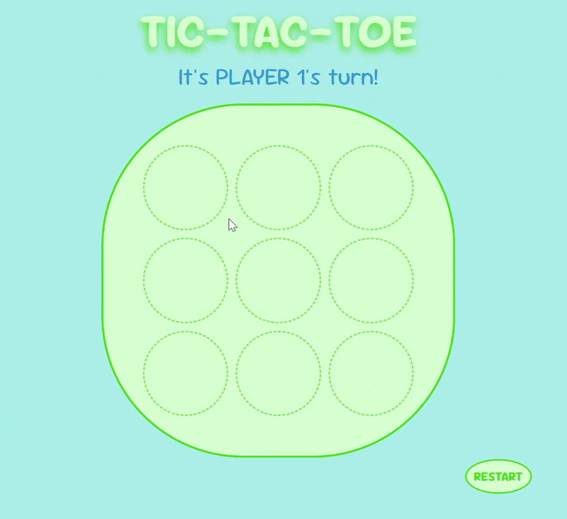

# Tic-Tac-Toe 🐸


[](https://opensource.org/licenses/MIT)

## About

Want to play a quick game of Tic Tac Toe in your browser? Bored with the standard "X" and "O" markers? Well then, do I have some good news for you! This application is a cute "Frogs vs. Flies" version of Tic Tac Toe that you can easily play with a friend right in your browser!

This project was created as a solution to an assignment in the Full Stack JavaScript Course by [The Odin Project](https://theodinproject.com). The assignment criteria called for a tic-tac-toe game that uses as little global code as possible, and to create the game using factory functions wrapped inside an IIFE.

### Built With
* 
* 
* 

## Usage

This game plays in all the same ways of traditional Tic Tac Toe. The frog icons equate to "X"s and the fly icons equate to "O"s. Player 1 will always be frogs and Player 2 will always be flies. 

Select an empty square to place your marker. Line up 3 of your markers in a row - horizontally, vertically, or diagonally - to win the game!



## Contributions

Contributions are more than welcome! This game was created as the solution to an assignment in The Odin Project, so it was made with that assignment criteria in mind, HOWEVER I'm still open to any and all suggestions, changes, improvements, etc.

If you have any contributions you would like to make, please fork the repo and create a pull request. You can also simply open an issue and tag "enhancement". 

1. Fork the Project
2. Create your Feature Branch (```git checkout -b feature/AmazingFeature```)
3. Commit your Changes (```git commit -m 'Adding AmazingFeature'```)
4. Push to the Branch (```git push origin feature/AmazingFeature```)
5. Open a Pull Request

## License

Distributed under the [MIT License](https://opensource.org/licenses/MIT). 

## Contact

Feel free to [send me an email](mailto:kmfoster212@gmail.com) with any questions, suggestions, bugs found, etc!

Project Link: https://github.com/kmmoody212/tic-tac-toe

**THANKS FOR VISITING! 😁**
